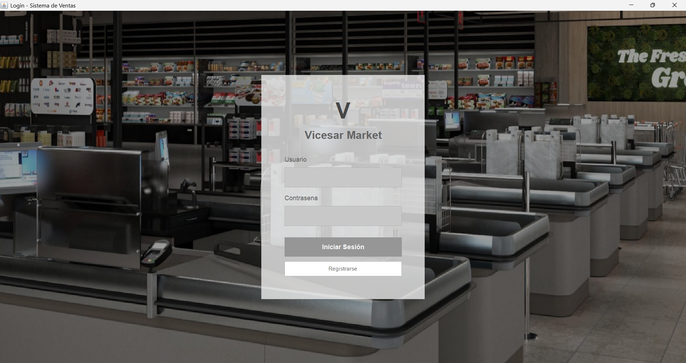
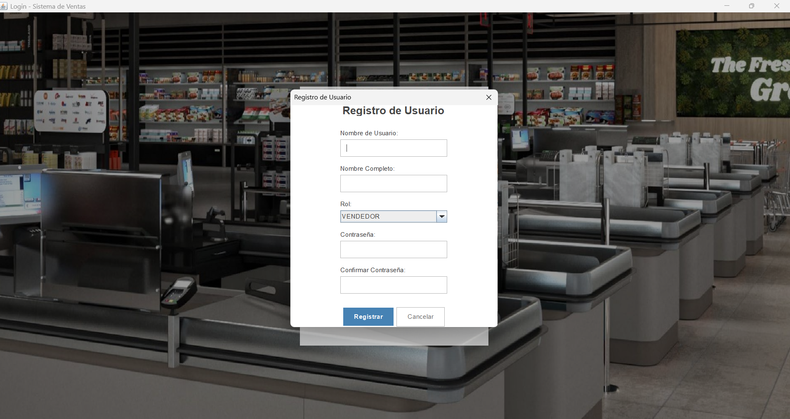
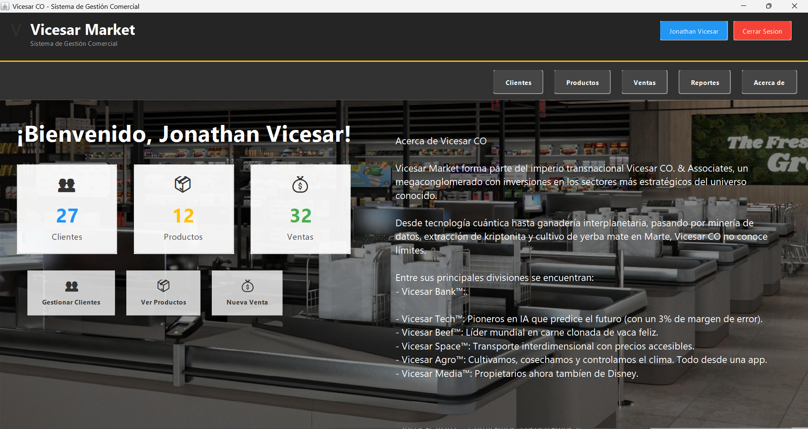
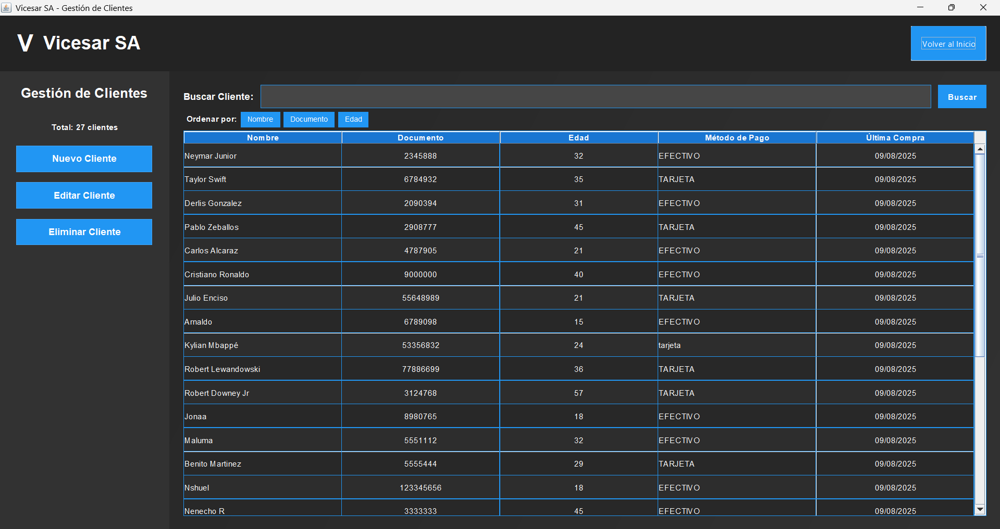
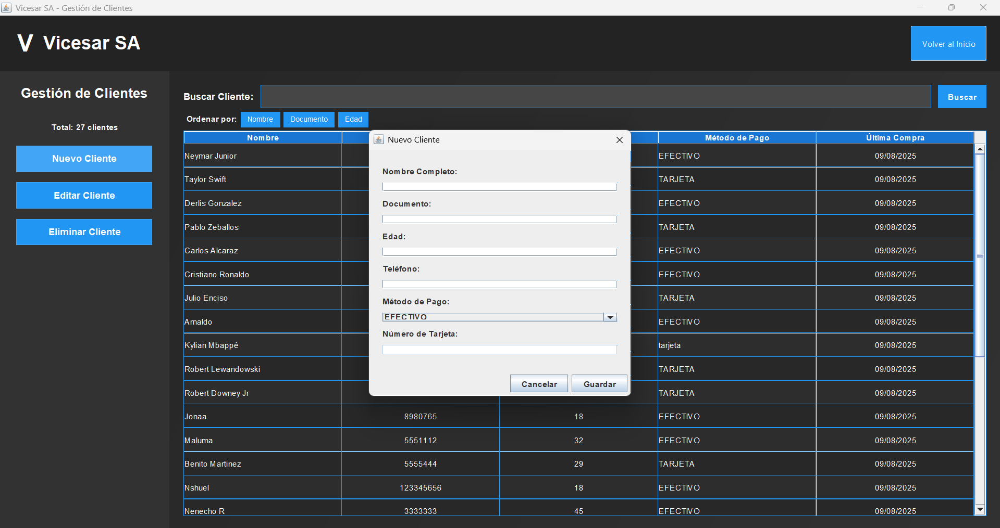
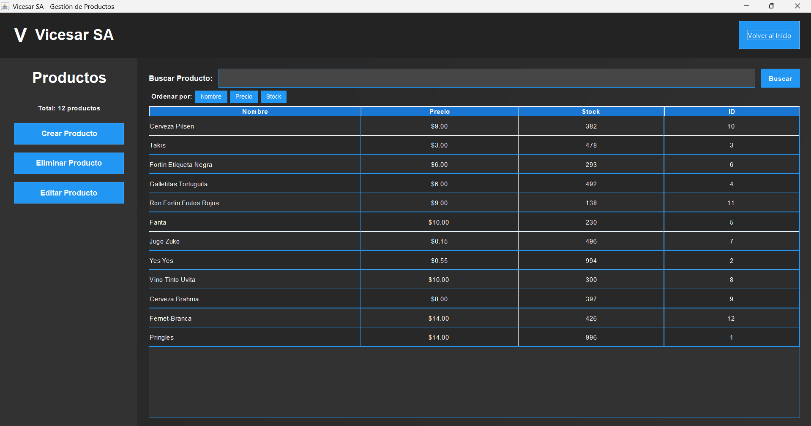
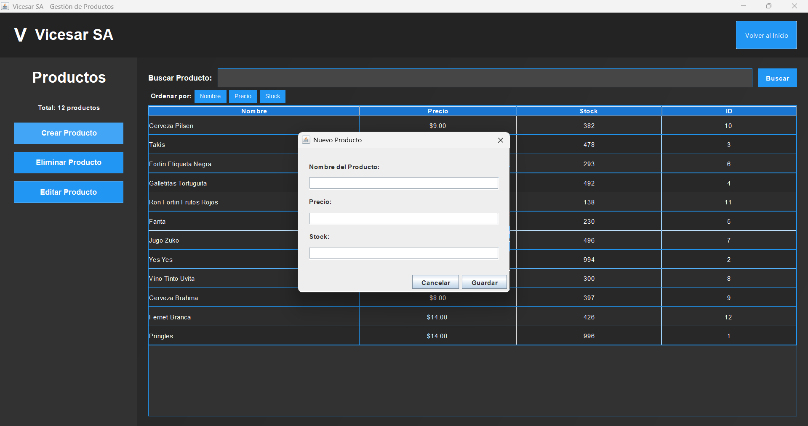
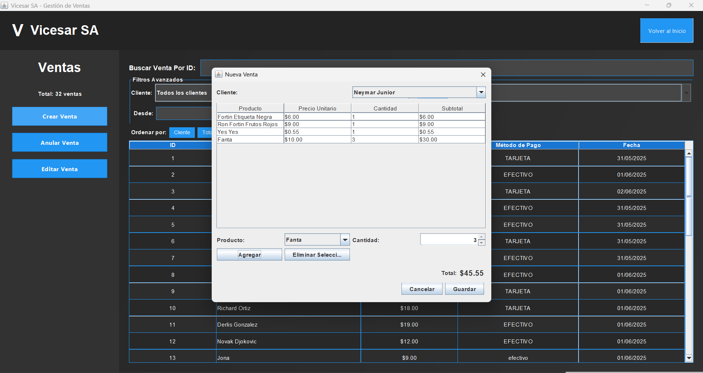
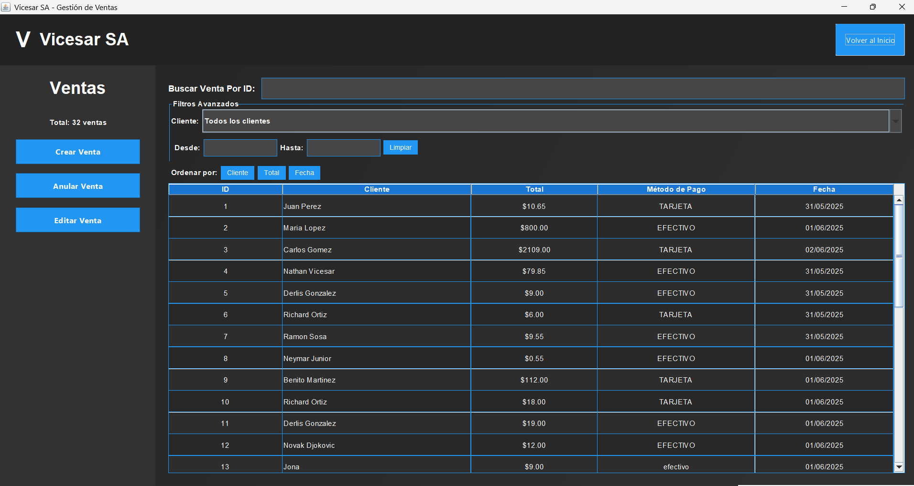

# Sistema de Ventas - Java Swing

<div align="center">
  <h3>Aplicación de Escritorio para Gestión de Ventas</h3>
  <p><strong>Proyecto #2 - Programación II </strong></p>
  <p><em>Facultad de Ingeniería Universidad Nacional de Itapúa</em></p>
</div>

---

## Descripción del Proyecto

Este es un proyecto académico desarrollado para la materia Programación II.

Sistema completo de gestión de ventas desarrollado con **Java Swing** que permite administrar productos, clientes y ventas a través de una interfaz gráfica intuitiva. Este proyecto representa la evolución del sistema de consola del <a href="https://github.com/JonaVicesar/ProyectoCLI-VentasCLI-Java.git" target="_blank">Proyecto #1</a>, ahora con una interfaz de usuario.

## Características Principales

### **Sistema de Autenticación**
- Login y registro de usuarios
- Control de acceso al sistema

### **Gestión de Clientes**
- Crear, editar, eliminar y listar clientes
- Ordenamiento por nombre o edad (usando Comparator)
- Visualización en tablas interactivas

### **Gestión de Productos**
- CRUD completo de productos
- Control de precios y stock
- Lista organizada en tabla

### **Sistema de Ventas**
- Crear ventas con múltiples productos
- Especificar cantidades por producto
- Anular ventas (cambio de estado)
- Filtrar ventas por fecha
- Filtrar ventas por cliente
- Informes de ventas anuladas

### **Persistencia de Datos**
- Almacenamiento en archivos JSON
- Carga automática al iniciar
- Guardado automático de cambios

## Tecnologías Utilizadas

- **Java 22** - Lenguaje principal
- **Swing** - Framework para interfaz gráfica
- **Maven** - Gestión de dependencias y construcción
- **Gson 2.10.1** - Serialización/deserialización JSON

## Arquitectura del Proyecto

```
src/main/java/com/ventas/
├── auth/           # Sistema de autenticación
├── controlador/    # Lógica de negocio (MVC)
├── modelo/         # Entidades del dominio
├── repositorio/    # Acceso a datos
├── util/           # Utilidades y recursos
├── vista/          # Interfaces gráficas (Swing)
└── VentasApp.java  # Clase principal
```

## Instalación y Ejecución

### Prerequisitos
- Java 22 o superior
- Maven 3.8+

### Pasos para ejecutar

1. **Clonar el repositorio**
   ```bash
   git clone [url-del-repositorio]
   cd ProyectoVentas
   ```

2. **Compilar el proyecto**
   ```bash
   mvn clean compile
   ```

3. **Ejecutar la aplicación**
   ```bash
   mvn exec:java -Dexec.mainClass="com.ventas.VentasApp"
   ```

## Estructura de Archivos de Datos

El sistema genera automáticamente los siguientes archivos JSON en la carpeta `data/`:

```
data/
├── clientes.json    # Base de datos de clientes
├── productos.json   # Catálogo de productos
├── usuarios.json    # Usuarios del sistema
└── ventas.json      # Registro de ventas
```

## Funcionalidades Implementadas

### Requisitos Obligatorios Cumplidos
- [x] Menú principal y secundarios
- [x] CRUD completo de Productos
- [x] CRUD completo de Clientes
- [x] Crear y listar Ventas
- [x] Anular ventas
- [x] Venta con cantidades específicas
- [x] Venta de múltiples productos
- [x] Visualización en tablas
- [x] Informe de ventas anuladas
- [x] Ordenamiento de clientes (Comparator)
- [x] Filtros de ventas por fecha y cliente
- [x] Uso de LayoutManagers

### Puntos Extra Implementados
- [x] **Persistencia en archivos JSON**
- [x] **Sistema completo de usuarios**
- [x] **Interfaz moderna con componentes personalizados**
- [x] **Validaciones avanzadas de datos**
- [x] **Manejo robusto de errores**

## Capturas de Pantalla

### Pantalla de Login


### Registro de Nuevo Usuario


### Menú Principal


### Gestión de Clientes
| Lista de Clientes | Crear Nuevo Cliente |
|-------------|---------------|
|  |  |


### Gestión de Productos
| Lista de Productos | Nuevo Producto | 
|-------------|---------------| 
|  |  |

### Sistema de Ventas
| Crear Venta | Listar Ventas |
|-------------|---------------|
|  |  |


## Configuración de Desarrollo

### Dependencias Maven
```xml
<dependency>
    <groupId>com.google.code.gson</groupId>
    <artifactId>gson</artifactId>
    <version>2.10.1</version>
</dependency>
```

### Configuración de Java
- **Versión**: Java 22
- **Build Tool**: Maven 3.11.0

---